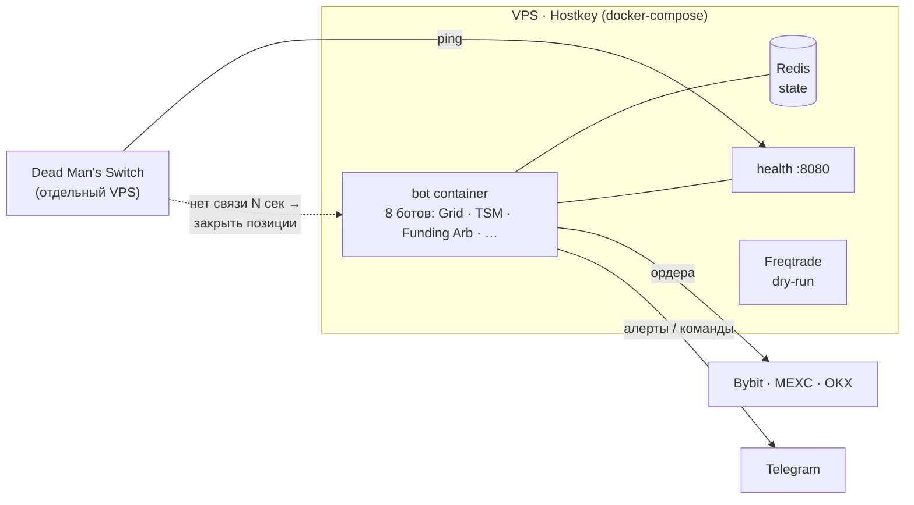

# crypto-trader


Мультибиржевая система автоматической торговли: несколько независимых торговых
ботов на общей архитектуре, работают 24/7 в Docker с персистентным состоянием в
Redis и аварийными защитами. Проект построен end-to-end через **Claude Code** как
портфельная работа по AI-автоматизации.

> ⚠️ **Режим:** paper / dry-run (тестовый, без реальных денег). Стратегии —
> учебные (Grid/momentum), валидированы бэктестами, но проект не заявляется как
> прибыльная live-система. Фокус — инженерная архитектура, риск-менеджмент и
> безопасная эксплуатация, а не «грааль».

## ✨ Ключевое

- **8 независимых ботов** на общей `BaseBot`-архитектуре, работают 24/7, состояние — в Redis (переживает рестарты).
- **Dead Man's Switch** между двумя VPS — при зависании бота позиции закрываются автоматически.
- **Риск-менеджмент** — лимиты просадки, exchange-level stop-loss, идемпотентные ордера, reduceOnly на закрытиях, net-PnL с учётом комиссий.
- **Безопасность** — секреты только из окружения (в репозитории нет ключей), **116 юнит-тестов**, Docker Compose.
- **Честный статус** — paper/dry-run; стратегии валидированы бэктестами, но проект про инженерию и риск, а не «грааль».

## Архитектура



- **`bots/base.py`** — `BaseBot`: единый жизненный цикл (tick-loop, счётчик ошибок,
  heartbeat в Redis, snapshot/restore состояния).
- **`core/`** — общие сервисы: `exchange.py` (единый интерфейс бирж), `state.py`
  (Redis), `portfolio.py`, `analytics.py`, `security.py` (загрузка секретов из
  окружения), `emergency_stop.py`, `watchdog.py`, `withdrawal_router.py`.
- **`main.py`** — точка входа, регистрация ботов, оркестрация.

## Боты

| Бот | Стратегия |
|---|---|
| **Grid** | Сеточная торговля в диапазоне (якорный бот, mark-to-market учёт PnL) |
| **TSM** | Time-Series Momentum (Donchian breakout на дневках, long/short) |
| **Funding Arb** | Funding-carry: шорт перп + лонг спот на экстремумах ставки |
| **Scalper / Breakout** | Внутридневные (отключены после бэктеста — не прошли валидацию) |
| **Stat Arb** | Парная торговля (в разработке) |
| **Analyzer / Redistributor** | Аналитика портфеля и ребалансировка |
| **Freqtrade NFI** | Внешний движок, dry-run на спот-Bybit |

## Инженерные акценты

- **Безопасность секретов:** все ключи/токены — только из окружения (`.env`,
  не в репозитории; см. `.env.example`). Никаких секретов в коде и истории.
- **Отказоустойчивость:** Dead Man's Switch между двумя VPS — при зависании бота
  позиции закрываются автоматически; `emergency_stop`, reduceOnly на закрытиях,
  идемпотентность ордеров, re-raise `CancelledError`, снапшот состояния после
  каждой мутации.
- **Риск-менеджмент:** лимиты просадки, sizing с margin-cap, exchange-level SL,
  учёт комиссий в net-PnL.
- **Эксплуатация:** Docker Compose, деплой на VPS, health-check, Telegram-алерты.

## Стек

Python · pybit / ccxt (Bybit, MEXC, OKX) · asyncio · Redis · pandas / numpy / ta ·
python-telegram-bot · Docker Compose · Freqtrade.

## Запуск

```bash
cp .env.example .env      # заполнить ключи бирж (paper/testnet), TRADING_MODE=paper
docker compose up --build -d
```

Секреты берутся из `.env` (в `.gitignore`). Репозиторий не содержит ключей.

---

*Портфельный проект. Разработка ведётся через Claude Code: архитектуру и код
формулирую и веду через ассистента, тестирую, деплою и принимаю решения сам.*
